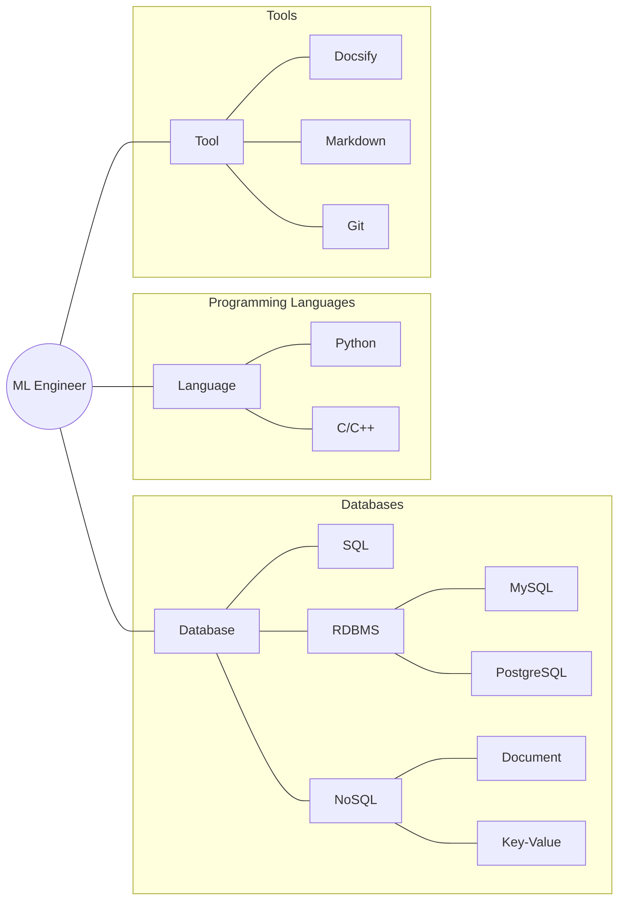

```mermaid
flowchart LR
root --- Database
root --- Language
root --- Tool

subgraph Databases
Database --- SQL
Database --- RDBMS
Database --- NoSQL
RDBMS --- MySQL
RDBMS --- PostgreSQL
NoSQL --- Document
NoSQL --- Key-Value
end

subgraph Programming Languages
Language --- Python
Language --- C/C++
end

subgraph Tools
Tool --- Docsify
Tool --- Markdown
Tool --- Git
end

root((ML Engineer))
click Docsify href "#/manuals/docsify"
click Markdown href "#/manuals/markdown"
click Git href "#/manuals/git"
```