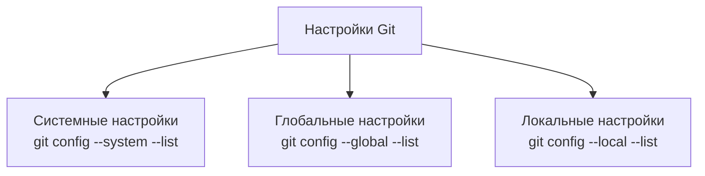
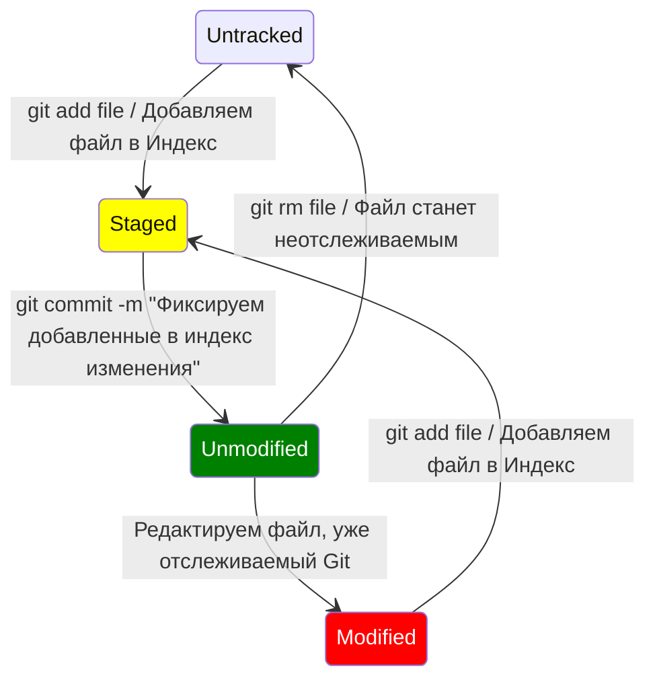

# Что это такое Git?

Git — это распределённая система управления версиями, которая позволяет разработчикам отслеживать изменения в коде, совместно работать над проектами и управлять различными версиями программного обеспечения.
>Git был создан Линусом Торвальдсом в 2005 году, чтобы помочь в разработке ядра Linux, и с тех пор стал стандартом де-факто для управления исходным кодом в мире программирования.

## Основные особенности

 - Распределённость - каждый разработчик имеет полную копию репозитория.
 - Быстрота и эффективность.
 - Ветвление и слияние.
 - Поддержка неограниченного количества пользователей.
 - Простота интеграции с различными сервисами.

## Установка Git

```bash
# Обновление списка пакетов
sudo apt update

# Установка Git
sudo apt install git

# Проверка версии установленного Git
git --version
```
Если Git уже установлен, для обновления выполните следующие шаги:
```bash
# Обновление списка пакетов
sudo apt update

# Установка обновлений для всех пакетов, включая Git
sudo apt upgrade
```

## Настройка Git


Системные настройки применяются ко всем пользователям и репозиториям на данном компьютере. Эти настройки хранятся в файле `/etc/gitconfig`.

Глобальные настройки применяются ко всем репозиториям текущего пользователя. Эти настройки хранятся в файле `~/.gitconfig` или `~/.config/git/config`.
```bash
# Просмотр глобальных настроек
git config --global --list

# Настройка имени пользователя и электронной почты
git config --global user.name "Name Surname"
git config --global user.email "address@mail.com"
```
Локальные настройки применяются только к текущему репозиторию. Эти настройки хранятся в файле `.git/config` внутри каталога репозитория.

>Если настройка определена на нескольких уровнях, Git использует значение с наивысшим приоритетом (локальный уровень имеет высший приоритет, затем глобальный, и наконец системный).

## Как создать локальный Git-репозиторий
```bash
# Создание нового репозитория
git init

# Клонирование существующего репозитория
git clone https://url-к-репозиторию.git
```
## Проверка состояния репозитория

Файлы в рабочем каталоге Git могут находиться в одном из двух состояний: отслеживаемый и неотслеживаемый. Эти состояния определяют, как Git взаимодействует с файлами. Давайте разберем их подробнее.

### Отслеживаемые файлы
Отслеживаемые файлы — это файлы, которые уже находятся под версионным контролем Git. Эти файлы могут находиться в одном из трех подкатегорий состояний:

1.  **Неизмененные (unmodified)**: Файлы, которые не изменялись с последнего коммита.
2.  **Измененные (modified)**: Файлы, которые были изменены, но еще не добавлены в индекс (staging area).
3.  **Проиндексированные (staged)**: Файлы, которые были изменены и добавлены в индекс, но еще не закоммичены.

### Неотслеживаемые файлы
Неотслеживаемые файлы — это файлы, которые находятся в рабочем каталоге, но еще не были добавлены в индекс. Git не следит за изменениями в этих файлах до тех пор, пока они не будут явно добавлены под контроль.

### Команды для работы с файлами
```bash
# Проверка состояния файлов
git status

# Добавление файлов в отслеживаемые
git add <имя_файла>

# Добавить все файлы
git add .

# После добавления в индекс, файлы можно закоммитить
git commit -m "Сообщение коммита"
```


### Игнорирование файлов
Иногда вам нужно, чтобы Git игнорировал определенные файлы или каталоги. Для этого используйте файл `.gitignore`.

Пример файла `.gitignore`:
```bash
# Игнорировать все файлы .log
*.log

# Игнорировать каталог build/
build/
```
Файл `.gitignore` должен быть добавлен в репозиторий:
```bash
git add .gitignore
git commit -m "Добавлен файл .gitignore"
```


## _to be continued..._
