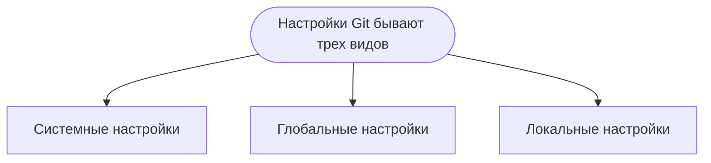

# Что это такое Git?

Git — это распределённая система управления версиями, которая позволяет разработчикам отслеживать изменения в коде, совместно работать над проектами и управлять различными версиями программного обеспечения.
>Git был создан Линусом Торвальдсом в 2005 году, чтобы помочь в разработке ядра Linux, и с тех пор стал стандартом де-факто для управления исходным кодом в мире программирования.

## Основные особенности

 - Распределённость - каждый разработчик имеет полную копию репозитория.
 - Быстрота и эффективность.
 - Ветвление и слияние.
 - Поддержка неограниченного количества пользователей.
 - Простота интеграции с различными сервисами.

## Установка Git

```bash
# Обновление списка пакетов
sudo apt update

# Установка Git
sudo apt install git

# Проверка версии установленного Git
git --version
```
Если Git уже установлен, для обновления выполните следующие шаги:
```bash
# Обновление списка пакетов
sudo apt update

# Установка обновлений для всех пакетов, включая Git
sudo apt upgrade
```

## Настройки Git


Системные настройки применяются ко всем пользователям и репозиториям на данном компьютере. Эти настройки хранятся в файле `/etc/gitconfig`.
```bash
git config --system --list

sudo git config --system user.name "Ваше Имя"
sudo git config --system user.email "ваш.email@example.com"
```
Глобальные настройки применяются ко всем репозиториям текущего пользователя. Эти настройки хранятся в файле `~/.gitconfig` или `~/.config/git/config`.
```bash
git config --global --list

git config --global user.name "Ваше Имя"
git config --global user.email "ваш.email@example.com"
```
Локальные настройки применяются только к текущему репозиторию. Эти настройки хранятся в файле `.git/config` внутри каталога репозитория.
```bash
git config --system --list

sudo git config --system user.name "Ваше Имя"
sudo git config --system user.email "ваш.email@example.com"
```
>Если настройка определена на нескольких уровнях, Git использует значение с наивысшим приоритетом (локальный уровень имеет высший приоритет, затем глобальный, и наконец системный).


## Базовые возможности

### Отслеживание изменений
- **История изменений**: Git сохраняет все изменения в проекте, позволяя разработчикам просматривать и анализировать историю изменений.
- **История коммитов**: Каждое изменение фиксируется в виде коммита, который содержит метаданные (автор, дата, сообщение) и набор изменений.

### Распределённость
- **Локальные репозитории**: Каждый разработчик имеет полную копию репозитория, включая всю историю изменений. Это обеспечивает автономную работу без постоянного подключения к серверу.
- **Удалённые репозитории**: Возможность синхронизации локальных репозиториев с удалёнными серверами для совместной работы и обмена изменениями.

### Ветвление и слияние
- **Ветвление**: Создание отдельных веток для разработки новых функций, исправления ошибок или экспериментов без влияния на основную кодовую базу.
- **Слияние (merge)**: Объединение изменений из разных веток, что позволяет интегрировать новые функции или исправления в основную ветку.

### Работа с индексом (стейджинг)
- **Индекс (стейджинг)**: Подготовка изменений для фиксации в коммите, что позволяет контролировать, какие изменения будут включены в следующий коммит.
- **Команды `git add` и `git reset`**: Управление изменениями в индексе, добавление или удаление изменений из стейджинга.

### Сравнение изменений
- **Диффы**: Возможность просмотра различий между версиями файлов с помощью команды `git diff`. Это помогает анализировать изменения и понимать, что было изменено.

### Управление версиями
- **Теги**: Создание меток (тегов) для определённых версий кода, что упрощает выпуск релизов и версионирование программного обеспечения.
- **Команды `git tag` и `git checkout`**: Создание и управление метками, переключение между версиями кода.

### Совместная работа
- **Пулы (pull requests)**: Возможность запрашивать обзор и слияние изменений из одной ветки в другую, что облегчает командную работу и код-ревью.
- **Команды `git pull` и `git push`**: Синхронизация изменений между локальными и удалёнными репозиториями, получение изменений от других разработчиков и отправка своих изменений.

### Работа с конфигурацией
- **Команды `git config`**: Настройка параметров Git, таких как имя пользователя, электронная почта и другие параметры, специфичные для репозитория или глобальные настройки.

### Восстановление и отмена изменений
- **Команды `git checkout`, `git reset` и `git revert`**: Восстановление предыдущих версий файлов, отмена коммитов и откат изменений.

