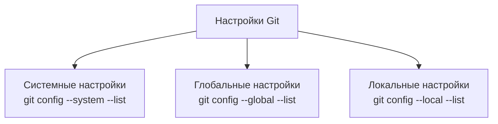
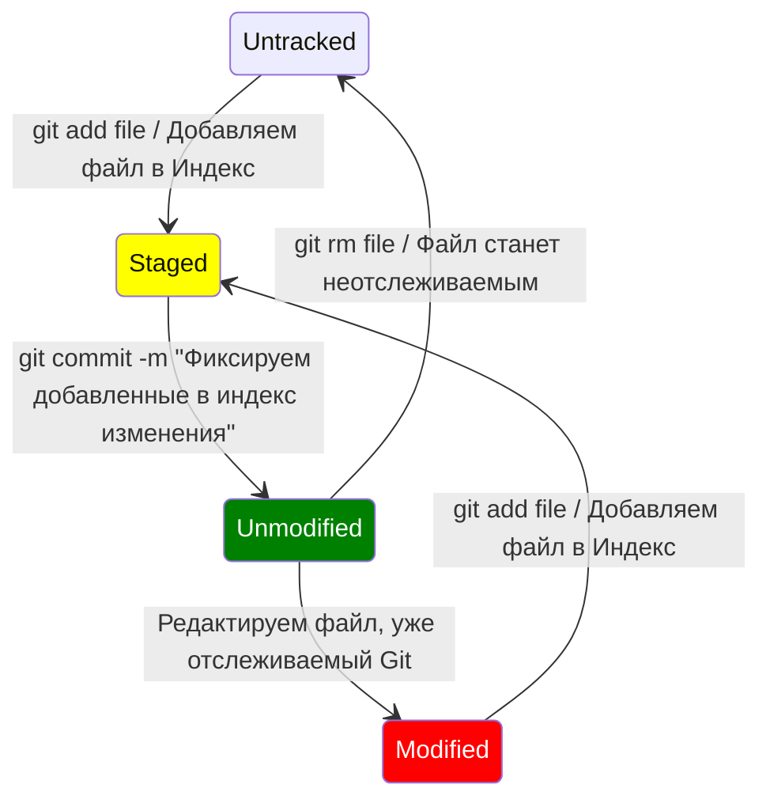

# Что это такое Git?

Git — это распределённая система управления версиями, которая позволяет разработчикам отслеживать изменения в коде, совместно работать над проектами и управлять различными версиями программного обеспечения.
>Git был создан Линусом Торвальдсом в 2005 году, чтобы помочь в разработке ядра Linux, и с тех пор стал стандартом де-факто для управления исходным кодом в мире программирования.

## Основные особенности

 - Распределённость - каждый разработчик имеет полную копию репозитория.
 - Быстрота и эффективность.
 - Ветвление и слияние.
 - Поддержка неограниченного количества пользователей.
 - Простота интеграции с различными сервисами.

## Установка Git

```bash
# Обновление списка пакетов
sudo apt update

# Установка Git
sudo apt install git

# Проверка версии установленного Git
git --version
```
Если Git уже установлен, для обновления выполните следующие шаги:
```bash
# Обновление списка пакетов
sudo apt update

# Установка обновлений для всех пакетов, включая Git
sudo apt upgrade
```

## Настройка Git


Системные настройки применяются ко всем пользователям и репозиториям на данном компьютере. Эти настройки хранятся в файле `/etc/gitconfig`.

Глобальные настройки применяются ко всем репозиториям текущего пользователя. Эти настройки хранятся в файле `~/.gitconfig` или `~/.config/git/config`.
```bash
# Просмотр глобальных настроек
git config --global --list

# Настройка имени пользователя и электронной почты
git config --global user.name "Name Surname"
git config --global user.email "address@mail.com"
```
Локальные настройки применяются только к текущему репозиторию. Эти настройки хранятся в файле `.git/config` внутри каталога репозитория.

>Если настройка определена на нескольких уровнях, Git использует значение с наивысшим приоритетом (локальный уровень имеет высший приоритет, затем глобальный, и наконец системный).

## Как создать локальный Git-репозиторий
```bash
# Создание нового репозитория
git init

# Клонирование существующего репозитория
git clone https://url-к-репозиторию.git
```
## Проверка состояния репозитория

Файлы в рабочем каталоге Git могут находиться в одном из двух состояний: отслеживаемый и неотслеживаемый. Эти состояния определяют, как Git взаимодействует с файлами. Давайте разберем их подробнее.

### Отслеживаемые файлы
Отслеживаемые файлы — это файлы, которые уже находятся под версионным контролем Git. Эти файлы могут находиться в одном из трех подкатегорий состояний:

1.  **Неизмененные (unmodified)**: Файлы, которые не изменялись с последнего коммита.
2.  **Измененные (modified)**: Файлы, которые были изменены, но еще не добавлены в индекс (staging area).
3.  **Проиндексированные (staged)**: Файлы, которые были изменены и добавлены в индекс, но еще не закоммичены.



### Неотслеживаемые файлы
Неотслеживаемые файлы — это файлы, которые находятся в рабочем каталоге, но еще не были добавлены в индекс. Git не следит за изменениями в этих файлах до тех пор, пока они не будут явно добавлены под контроль.

### Команды для работы с файлами
```bash
# Проверка состояния файлов
git status

# Добавление файлов в отслеживаемые
git add <имя_файла>

# Добавить все файлы
git add .
git add *
git add -А

# После добавления в индекс, файлы можно закоммитить
git commit -m "Сообщение коммита"
```

### Игнорирование файлов
Иногда вам нужно, чтобы Git игнорировал определенные файлы или каталоги. Для этого используйте файл `.gitignore`.

Пример файла `.gitignore`:
```bash
# Игнорировать все файлы .log
*.log

# Игнорировать каталог build/
build/
```
Файл `.gitignore` должен быть добавлен в репозиторий:
```bash
git add .gitignore
git commit -m "Добавлен файл .gitignore"
```

## История изменений (коммитов) `git log`
Чтобы посмотреть историю изменений (коммитов) в Git, можно использовать команду `git log`. Эта команда отображает список всех коммитов в текущем репозитории.
>Команда `git help log` используется для получения справочной информации о команде `git log`. Она выводит подробное описание, синтаксис, параметры и примеры использования команды `git log`. Это полезно, когда вам нужно узнать больше о возможностях и опциях `git log`.

### Форматированный вывод
Ниже приведены несколько полезных вариантов использования команды `git log`:
```bash
# Основная команда
git log

# Показывает последние 2 коммита
git log -2

# Краткий формат
git log --oneline

# Графическое отображение веток и слияний
git log --graph --oneline

# С выводом авторов и дат
git log --pretty=format:"%h - %an, %ar : %s"
```
### Фильтрация коммитов
```bash
# По автору
git log --author="Имя автора"

# По дате
git log --since="2023-01-01" --until="2023-12-31"

# По ключевому слову в сообщении
git log --grep="ключевое слово"
```

### Отображение истории с изменениями
Команда `git log --patch` используется для отображения подробной истории коммитов с включением патчей (изменений) для каждого коммита. Это позволяет увидеть конкретные изменения, внесенные каждым коммитом в код.
```bash
# Детализирует изменения, внесенные каждым коммитом
git log --patch

# Для конкретного файла
git log --patch <имя_файла>
```
### История с краткой статистикой изменений
Команда `git log --stat` выводит список коммитов, сопровождаемый статистикой изменений для каждого коммита. Статистика включает количество добавленных и удаленных строк для каждого измененного файла.
```bash
# C краткой статистикой изменений
git log --stat

# Для конкретного файла
git log --stat <имя_файла>

# В одну строку на коммит для файла
git log --oneline --stat <имя_файла>
```

### Информация о конкретном коммите

Команда `git show` используется для отображения информации о конкретном коммите, включая изменения, внесенные в файлы, а также метаданные коммита. Она сочетает в себе возможности `git log` и `git diff`, предоставляя полную информацию о коммите в одном удобном формате.
```bash
# Показать информацию о последнем коммите
git show

# Показать информацию о конкретном коммите, где <commit> хэш нужного коммита
git show <commit>

# Показать информацию о коммите и конкретном файле
git show <commit>:<path/to/file>

# Показать изменения для нескольких коммитов
git show <commit1> <commit2> ...

# Ограничение вывода для конкретного файла
git show <commit> -- <path/to/file>

# Отображение информации о тегах или ветках
git show <tag_or_branch>
```
## Функциональность `git checkout`
Команда `git checkout` работает с тремя объектами:

 1. файлами
 2. коммитами
 3. ветками

### По отношению к файлам
Команда `git checkout` по отношению к файлам используется для восстановления файлов из другой ветки, коммита или индекса. Она позволяет отменить изменения в рабочей директории или вернуть файл в состояние, соответствующее указанной ветке или коммиту.

```bash
# Вернуть файл в состояние, которое было после последнего git add
git checkout -- имя_файла

# Восстановить файл из конкретного коммита
git checkout <commit_hash> -- имя_файла

# Восстановление файла из другой ветки
git checkout <ветка> -- имя_файла
```
Команда `git checkout -- имя_файла` удаляет все несохраненные изменения в файле, поэтому будьте осторожны, чтобы не потерять важные данные.

>Рекомендуется для восстановления файлов использовать команду `git restore`, которая делает то же самое, но является более интуитивной.

### По отношению к коммитам
Команда `git checkout` по отношению к коммитам позволяет переключаться на конкретный коммит в истории. Это полезно для просмотра состояния репозитория на момент определенного коммита или для создания новой ветки от старого коммита.

Однако, при переключении на конкретный коммит создается "detached HEAD" состояние, что означает, что вы находитесь не на ветке, а на отдельном коммите.

>В состоянии "detached HEAD" любые изменения, которые вы сделаете, будут потеряны при переключении на другую ветку, если они не будут закоммичены в новую ветку или существующую ветку.

```bash
# Чтобы переключиться на конкретный коммит, используйте его хеш
git checkout <commit_hash>

# Создание новой ветки от конкретного коммита
git checkout -b <new_branch_name> <commit_hash>

# Как выйти из состояния "detached HEAD"
git checkout master

# Примеры использования
git checkout d4e5f6g7
git checkout -b fix-bug a1b2c3d4
```
>Для переключения на коммиты и ветки можно также использовать более новые и специализированные команды, такие как `git switch`.

### По отношению к веткам
Команда `git checkout` по отношению к веткам используется для переключения между ветками, создания новых веток и переключения на них. Это одна из наиболее часто используемых команд в Git для работы с ветками.
```bash
# Переключение на существующую ветку
git checkout <branch_name>

# Создание новой ветки и переключение на нее
git checkout -b <new_branch_name>

# Переключение на удаленную ветку
git fetch origin
git checkout -b <branch_name> origin/<branch_name>
```
> Команда `git fetch origin` используется для извлечения изменений из удаленного репозитория, указанного как `origin`, в ваш локальный репозиторий. Эта команда обновляет ваши локальные копии веток, но не сливает изменения в ваши текущие рабочие ветки.

## Что такое `HEAD`, `Индекс` и `Рабочий каталог` .
В Git существует три основных компонента, которые управляют состоянием репозитория и версионируемых файлов. Эти компоненты — HEAD, индекс (staging area) и рабочий каталог (working directory). Разберем каждый из них подробнее.
### HEAD
**HEAD** — это указатель на текущую ветку и коммит, над которым вы работаете. В обычной ситуации HEAD указывает на последний коммит в текущей ветке. Когда вы переключаетесь на другую ветку или делаете `git checkout`, HEAD перемещается и указывает на новую ветку или коммит.
> **HEAD в detached состоянии**: Если вы проверяете конкретный коммит вместо ветки (`git checkout <commit>`, а не `git checkout <branch>`), HEAD будет в так называемом "detached" состоянии, где он указывает на конкретный коммит, а не на ветку. Изменения, сделанные в этом состоянии, могут быть потеряны, если вы не создадите новую ветку и не зафиксируете их.
### Индекс (Staging Area)
**Индекс** (или staging area) — это промежуточная область, где вы подготавливаете изменения перед тем, как зафиксировать их в репозитории. Когда вы добавляете файлы в индекс с помощью команды `git add`, они копируются из рабочего каталога в индекс. Это позволяет вам создать набор изменений, которые вы хотите зафиксировать, без необходимости фиксировать все изменения в рабочем каталоге.
> Добавляя файлы в индекс (`git add <file>`), вы говорите Git, что эти файлы должны быть включены в следующий коммит. Это позволяет вам частично коммитить изменения, оставляя остальные файлы в рабочем каталоге для дальнейших доработок.
### Рабочий каталог (Working Directory)
**Рабочий каталог** — это место, где находятся файлы вашего проекта. Когда вы клонируете репозиторий, Git извлекает данные из последнего коммита и помещает их в рабочий каталог. Здесь вы можете редактировать, создавать и удалять файлы. 
> Когда вы изменяете файлы в рабочем каталоге, эти изменения сначала отображаются только в нем и считаются неотслеживаемыми или измененными. Чтобы Git знал о ваших изменениях и мог их зафиксировать, вы должны добавить их в индекс.
### Взаимодействие между компонентами
-   **Изменение файлов в рабочем каталоге**: Любые изменения, сделанные в файлах, сначала отражаются в рабочем каталоге.
-   **Добавление в индекс**: С помощью команды `git add <file>` вы перемещаете изменения из рабочего каталога в индекс.
-   **Фиксация изменений**: С помощью команды `git commit -m "сообщение коммита"` вы фиксируете изменения, находящиеся в индексе, создавая новый коммит, на который будет указывать HEAD.


## _to be continued..._


